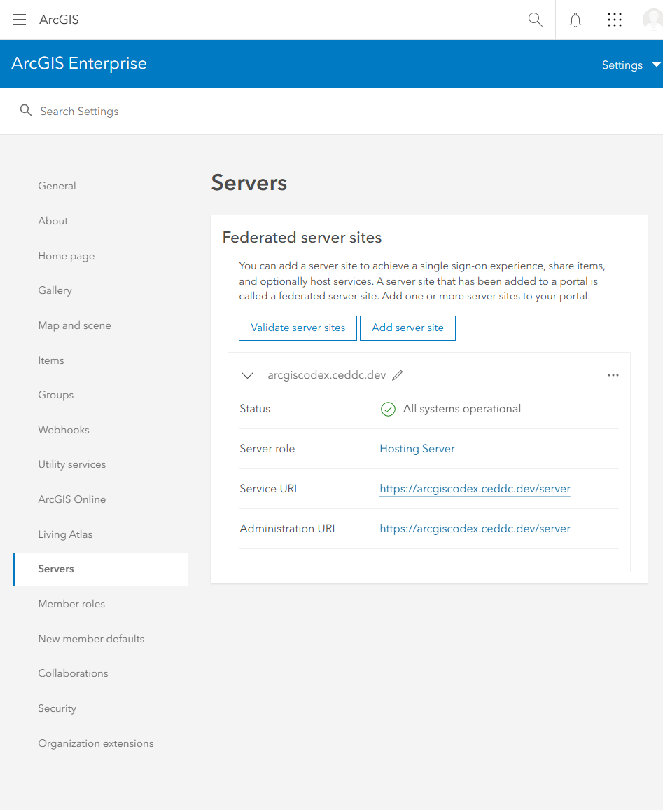
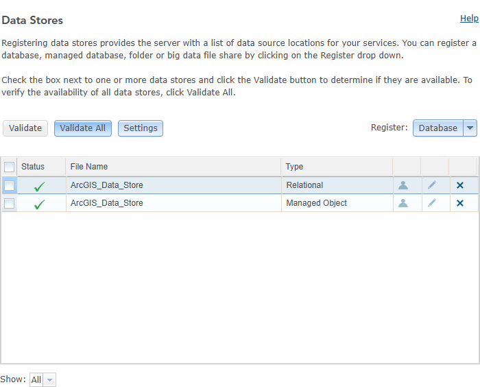

# ArcGIS Enterprise Agent Setup

This repository is a documentation-only record of an ArcGIS Enterprise 11.5 single-machine base deployment performed with the [OpenAI Codex Windows app](https://openai.com/codex/) using a GPT-5-based Codex agent together with `arcgis-powershell-dsc` v5.0.0. It keeps the real public hostname `arcgiscodex.ceddc.dev`, but removes secrets, credential material, and low-value machine-local details.

> Warning
>
> This is a for-fun tech experiment. It is not a recommended way to install ArcGIS Enterprise and it is not official in any capacity.

## Initial Prompt

```text
Hey ChatGPT/Codex, can you set up ArcGIS Enterprise 11.5 on this VM for me? Thanks.
Please use the latest release of https://github.com/Esri/arcgis-powershell-dsc (v5). Read the wiki for the commands and parameters and create a single machine base deployment json config configured for public access on "arcgiscodex.ceddc.dev", arcgiscodex.ceddc.dev is a dns alias redirecting to 127.0.0.1 .
Do not forget  to set the Object Store.
You should write the correct JSON config and then install using the Esri DSC module. Licenses are in the local folder, agol_user and agol_password are in environment variables. Install all in c:/ArcGIS Wait for the module installation to finish before attempting to troubleshoot, the process can be long.
Please report regularly the verbose advancement.
 You have no prerequisites yet so download and install thhem.
Use the users portaladmin and siteadmin and define passwords that are compliant with Portal and Server requirements. Once the setup is complete, please test using Playwright MCP: connect to the Portal and take screenshots of Portal > Server validation and Data Store validation in Server Manager. Please write to disk in .md files all the actions you perform and the choices you make during runtime.
You must achieve the result without asking me questions, please one shot it as we say now.
```

## Final Status Summary

ArcGIS Enterprise 11.5 was installed successfully as a single-machine base deployment with Portal, a federated hosting server, the relational data store, and the object store configured for `https://arcgiscodex.ceddc.dev`. Public Portal and Server REST checks succeeded, and the Portal-side federation validation showed the hosting server as operational.

Server Manager data store validation also succeeded and showed successful checks for both the relational store and the managed object store. The deployment finished with a working Portal, a federated hosting server, registered ArcGIS Data Store components, and captured browser validation screenshots.

## Actions During the Run

1. Reviewed the `arcgis-powershell-dsc` v5 repository and wiki to confirm the expected JSON structure, resource names, and parameters for a single-machine base deployment at ArcGIS Enterprise 11.5.
2. Gathered the local inputs required for the run: license files from disk, ArcGIS Online credentials from environment variables, and the target public hostname `arcgiscodex.ceddc.dev`.
3. Prepared the install layout under `C:\ArcGIS`, including directories for installers, licenses, and certificates.
4. Downloaded the missing prerequisites and ArcGIS media needed for ArcGIS Server, Portal for ArcGIS, ArcGIS Web Styles, ArcGIS Data Store, and the IIS web adaptors.
5. Created and trusted a local certificate for `arcgiscodex.ceddc.dev` so the public URL could be used consistently during validation on the VM.
6. Authored a single-machine deployment JSON for the Portal, Server, Data Store, and Web Adaptor roles, with public contexts `/portal` and `/server`, plus both `Relational` and `ObjectStore` datastore types.
7. Installed the Esri ArcGIS PowerShell DSC module version `5.0.0` and verified that the correct module path was loaded before starting configuration.
8. Ran `Invoke-ArcGISConfiguration` in install, license, and configure mode with verbose logging so the run could be resumed and troubleshot safely if a component stalled.
9. Completed the product installations for ArcGIS Server, Portal for ArcGIS, ArcGIS Web Styles, ArcGIS Data Store, and both web adaptors into the `C:\ArcGIS` layout.
10. Adjusted the Portal administrator password format to satisfy Portal 11.5 site-creation rules after the first retry exposed the stricter password validation behavior.
11. Re-ran DSC until the base deployment completed federation, hosting server setup, web adaptor integration, managed database registration, and object store registration without throwing an exception.
12. Verified the public Portal and Server REST endpoints after completion and wrote health-check output to disk for the private deployment record.
13. Used browser automation to sign in to Portal, confirm the hosting server validation status, open Server Manager, and capture the final validation screenshots included in this repository.

## Findings

1. Portal 11.5 enforced stricter password rules than the initial attempt satisfied. The Portal admin password had to be changed to a Portal-compliant format and the DSC run retried.
2. After that adjustment, the single-machine base deployment completed as expected with Portal federation, hosting server configuration, relational data storage, and managed object storage all registering successfully.

## Validation Screenshots

### Portal Federation Validation

The Portal organization settings show the federated hosting server on the public URL with status `All systems operational`.



### Server Manager Data Store Validation

Server Manager shows successful validation for both `ArcGIS_Data_Store` entries: `Relational` and `Managed Object`.



## Exclusions

This repository intentionally does not include the raw deployment JSON, the PowerShell installer, logs, transcripts, health-check outputs, license files, downloaded installer media, or the original runtime note files. It is meant to be a compact public-facing write-up rather than a full reproduction package.
